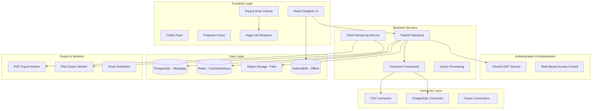

# Architecture Documentation

## System Overview

This is a web-based data visualization platform that recreates Power BI Desktop/Service functionality with select Tableau features. The system is designed as a modular, scalable architecture supporting both online (cloud) and offline (local browser) modes.

## High-Level Architecture

## Component Architecture

### Frontend Architecture
- **Designer UI**: React-based drag-and-drop interface
- **Canvas**: Interactive report/dashboard designer with grid snapping
- **Fields Pane**: Data source fields, measures, and dimensions
- **Properties Pane**: Visual configuration and formatting options
- **Renderer**: Vega-Lite based visualization rendering engine
- **State Management**: Zustand for application state
- **Offline Storage**: IndexedDB for local-first persistence

### Backend Architecture
- **API Layer**: FastAPI with OpenAPI documentation
- **Authentication**: JWT-based auth with OAuth2 support
- **Connector Framework**: Plugin-based data source connections
- **Query Engine**: SQL query generation and optimization
- **Render Service**: Server-side chart rendering for exports
- **Worker Pool**: Background job processing for exports/scheduling

### Data Architecture
- **Metadata Store**: PostgreSQL for user data, workspaces, reports
- **Cache Layer**: Redis for session management and query caching
- **Object Storage**: S3-compatible storage for datasets and exports
- **Offline Storage**: Browser IndexedDB for offline mode

## Technology Stack

### Frontend
- **Framework**: React 18 + TypeScript
- **Build Tool**: Vite
- **State Management**: Zustand
- **Drag & Drop**: React DnD
- **Visualization**: Vega-Lite + D3.js
- **Styling**: Tailwind CSS
- **Canvas**: React Flow for layout management

### Backend
- **Framework**: Python FastAPI
- **Database ORM**: SQLAlchemy
- **Authentication**: JWT + OAuth2
- **Validation**: Pydantic
- **Task Queue**: Celery with Redis
- **File Processing**: Pandas for CSV, SQLAlchemy for DB

### Infrastructure
- **Database**: PostgreSQL 15
- **Cache**: Redis 7
- **Storage**: MinIO (S3-compatible)
- **Containerization**: Docker + Docker Compose
- **Reverse Proxy**: Nginx

### Development
- **API Documentation**: OpenAPI/Swagger
- **Testing**: Pytest (backend), Vitest (frontend), Playwright (E2E)
- **Code Quality**: ESLint, Prettier, Black, mypy
- **CI/CD**: GitHub Actions

## Data Flow

### Report Creation Flow
1. User uploads CSV or connects to database via connector
2. System infers schema and stores metadata in PostgreSQL
3. User drags fields onto canvas to create visualizations
4. Frontend generates report JSON model
5. Backend validates and saves report model
6. Render service converts report model to Vega-Lite spec
7. Frontend renders visualization using Vega-Lite

### Query Execution Flow
1. User interacts with visualization (filter, drill-down)
2. Frontend generates query specification
3. Backend routes query to appropriate connector
4. Connector executes query against data source
5. Results cached in Redis for performance
6. Data returned to frontend for visualization update

### Offline Mode Flow
1. Reports and small datasets stored in IndexedDB
2. User can work offline with cached data
3. Changes tracked with operational transforms
4. On reconnection, conflicts resolved with last-writer-wins strategy
5. Sync service merges local and remote changes

## Security Architecture

### Authentication
- OAuth2 flow with JWT tokens
- Refresh token rotation
- Session management via Redis
- Password hashing with bcrypt

### Authorization
- Role-based access control (Owner/Editor/Viewer)
- Workspace-level permissions
- Object-level security for reports/dashboards
- API endpoint protection via decorators

### Data Security
- Encryption in transit (HTTPS/TLS)
- Encryption at rest for sensitive data
- Connection string encryption
- Audit logging for all operations

## Scalability Considerations

### Horizontal Scaling
- Stateless API servers behind load balancer
- Database read replicas for query performance
- Redis clustering for cache layer
- S3 for distributed file storage

### Performance Optimization
- Query result caching
- Connection pooling for database connectors
- Lazy loading for large datasets
- WebGL rendering for large visualizations
- Server-side pre-aggregation

### Resource Management
- Worker queues for export operations
- Connection limits per connector
- Memory limits for query execution
- Request rate limiting

## Offline-First Strategy

### Data Synchronization
- Operational transforms for concurrent edits
- Conflict resolution with merge strategies
- Version vectors for causality tracking
- Background sync with exponential backoff

### Local Storage
- IndexedDB for structured data (reports, metadata)
- Browser filesystem API for dataset caching
- Service worker for offline API responses
- Local query execution with DuckDB-wasm

## Extension Points

### Connector Framework
- Plugin interface for new data sources
- Registration system for connector discovery
- Configuration validation and testing
- Connection pooling and lifecycle management

### Visualization Engine
- Custom visual development framework
- Plugin marketplace for community visuals
- Vega-Lite extension API
- D3.js integration for advanced charts

### Transform Engine
- Custom calculation functions
- SQL expression parser
- DAX-like measure definitions
- Data modeling transformations